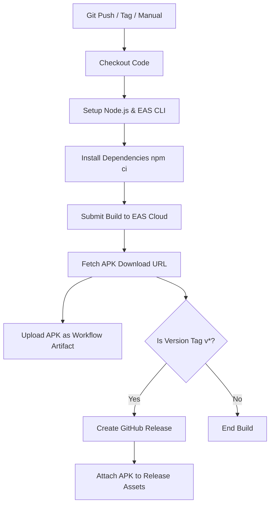

# Matinee 🎬

[](https://github.com/srinidhibhat45/Matinee/actions/workflows/build-apk.yml)
[](https://github.com/srinidhibhat45/Matinee/releases)
[](https://expo.dev)

Matinee is a premium, dark-themed cinema tracking and personalized recommendation mobile application built with React Native and Expo. It allows cinephiles to manage their watchlists, rate watched movies and TV series, view detailed viewing statistics, and discover new titles using an intelligent, local recommendation engine.

---

## 📱 Features & Highlights

### 🎨 Premium Cinema UI/UX
- **Sleek Dark Mode:** Tailored cinema-like visual language (Background: `#0A0A0F`, Cards: `#161621`).
- **Interactive Discover Feed:** Tabbed browse pages, horizontal carousels, customizable grid filters, and paginated searches with lazy loading.
- **Media Type Identifiers:** Visual badges indicating whether a title is a **Movie** or **Series** in the recommendations feed and all-inclusive lists.
- **Enhanced Watchlist Sorting:** Smart sorting rules partition your watchlist, prioritizing **Upcoming Releases** (sorted chronologically by release date) followed by **Released Titles** (latest releases first).

### 🧠 Advanced Recommendation Engine
- **Accurate Personalization (70%+):** An advanced scoring algorithm that evaluates titles based on user rating history, genre affinity, director/actor preferences, TMDB rating weight, and release recency.
- **Loved & Disliked Context:**
  - Positive ratings ($\ge$ 8/10) boost respective genres ($+3.5$) and director/actor scores ($+10$).
  - Negative ratings ($\le$ 5/10) penalize respective genres ($-5.0$) and blacklist/penalize associated directors/actors ($-40$).
- **Filmography Ingestion:** Automatically crawls and fetches credits for the user's top 3 loved directors and actors, injecting them into the candidate seeds.
- **Anti-Flooding Protection:**
  - *Franchise Cap:* Limits repetitive series (e.g., Marvel, Avengers, Star Wars, Spider-Man) by applying a major penalty ($-25$) if more than 2 entries are present in the feed.
  - *Genre Diversity Penalty:* Dynamically reduces scores for repeated genres ($-0.5$ per item) to keep the recommendation feed rich and varied.

### 🌐 Proportional Language Multiplexer
- Interleaves titles across different languages based on user preferences and watch patterns.
- Enforces a minimum **15% representation floor** for selected regional languages (e.g., Kannada, Hindi, Tamil, Telugu, Malayalam, Japanese, Korean) so regional titles are never drowned out by English blockbusters.

### 🔒 Bypass ISP & DNS Blocklists
- **API Failover Routing:** Automatically switches between multiple TMDB base URLs (`api.themoviedb.org`, `api.tmdb.org`, `tmdb.cub.red`, and `tmdb-proxy.vercel.app`) with a 6-second timeout controller to recover from ISP blocks.
- **Cloudflare Image Proxy:** Routes poster and backdrop requests through `images.weserv.nl` to bypass ISP-level and DNS-level blocks (e.g., Adguard DNS, Jio India) and cache images locally.
- **Custom User Proxy:** Includes a Profile Settings option to specify a custom private mirror URL.

### 📊 Comprehensive Insights & Stats Dashboard
- **Heatmap Grid:** GitHub-style contributions calendar mapping movies and series watched per day.
- **Interactive Visualizations:** Genre breakdowns, average rating distribution charts, top directors/actors, watch streaks, and total watch-time hours.

### 🔔 Calendar & Reminders
- **Expo Notifications:** Local notifications scheduled to alert you the day before a watchlist title releases (9:00 AM) and on release day (10:00 AM).
- **Google Calendar Integration:** Direct deep-link button (`Add to Calendar`) to add upcoming releases as all-day events on your Google Calendar.

---

## 🛠️ CI/CD Workflow & Automated Builds

Matinee uses **GitHub Actions** integrated with **Expo Application Services (EAS) CLI** to build the Android package (`.apk`) automatically on every code change.

### The Build Pipeline (`.github/workflows/build-apk.yml`)
The pipeline runs on:
1. Every `push` to the `main` branch.
2. Every version tag push (`v*`, e.g., `v1.0.0`).
3. Manual trigger via the GitHub **Actions** tab (`workflow_dispatch`).



#### Workflow Steps:
1. **Environment Setup:** Checks out the code, sets up Node.js 20, and installs `eas-cli`.
2. **EAS Authentication:** Authenticates with Expo Cloud using the `${{ secrets.EXPO_TOKEN }}` repository secret.
3. **Dependency Installation:** Runs `npm ci` for clean, reproducible installs.
4. **Cloud Build:** Submits build commands to EAS via:
   ```bash
   npx eas-cli build --platform android --profile preview --non-interactive
   ```
5. **APK Packaging:** Fetches the completed build artifact URL from the EAS build registry, downloads the APK, and uploads it back to the GitHub workflow run.
6. **Automatic Release (on Tag):** If triggered by a version tag (`v*`), it creates a GitHub Release, writes the release notes, and uploads the `.apk` directly to the release page.

---

## 📥 How to Download the APK

### Method 1: Download from GitHub Releases (Recommended)
This is the easiest way to download stable, versioned builds.
1. Navigate to the [Releases](https://github.com/srinidhibhat45/Matinee/releases) page of the repository.
2. Find the version you wish to install (e.g., `v1.0.0`).
3. Under the **Assets** header, click on `matinee-app.apk` to download it.
4. Open the downloaded file on your Android device and install it (enable "Install from Unknown Sources" if prompted).

**Direct Download Link for Version `v1.0.0`:**
> 📥 [matinee-app.apk (v1.0.0)](https://github.com/srinidhibhat45/Matinee/releases/download/v1.0.0/matinee-app.apk)

### Method 2: Download from Actions Artifacts (Latest Development Build)
If you want to try the absolute latest commits that haven't been tagged as a release yet:
1. Go to the [Actions](https://github.com/srinidhibhat45/Matinee/actions) tab of this repository.
2. Select the top workflow run labeled **Build Android APK** (with a green checkmark).
3. Scroll down to the **Artifacts** section at the bottom of the page.
4. Click on `matinee-android-apk` to download the ZIP file.
5. Extract the ZIP file on your device to get the `matinee-app.apk` and install it.

---

## 🚀 Local Setup & Development

To run, modify, or build the Matinee app on your local machine:

### 1. Prerequisites
- **Node.js:** v20 or newer
- **Git**
- **Expo Go** app installed on your physical device (Android/iOS)
- **EAS CLI** installed globally (for building):
  ```bash
  npm install -g eas-cli
  ```

### 2. Installation
Clone the repository and install the dependencies:
```bash
git clone https://github.com/srinidhibhat45/Matinee.git
cd Matinee
npm install
```

### 3. Run Locally
Start the Expo development server:
```bash
npm run start
```
- Open the **Expo Go** app on your phone.
- Scan the QR code displayed in the terminal to load the app.
- Make sure to enter your **TMDB API Key** in the settings section of the app's Profile tab to fetch movie data.

### 4. Build APK Locally
To build the APK locally using EAS:
1. Log in to your Expo account: `npx eas login`.
2. Configure the project: `npx eas project:init`.
3. Build the preview profile:
   ```bash
   npx eas-cli build --platform android --profile preview
   ```

---

## ⚙️ Repository Configuration

To enable automated builds on your fork or repository:
1. Go to **Settings > Secrets and variables > Actions** in your GitHub repository.
2. Click **New repository secret**.
3. Set the name to `EXPO_TOKEN`.
4. Enter your Expo access token (generated from the [Expo Dashboard](https://expo.dev/settings/access-tokens)).
5. Trigger a build by pushing a commit to `main` or creating a tag:
   ```bash
   git tag v1.0.0
   git push origin v1.0.0
   ```
